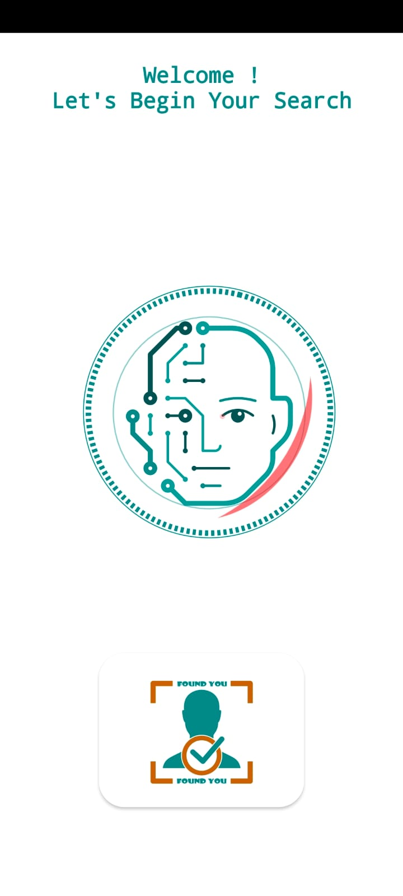
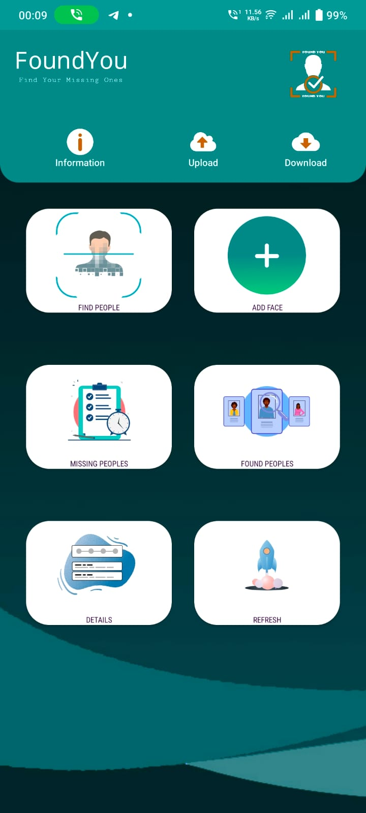
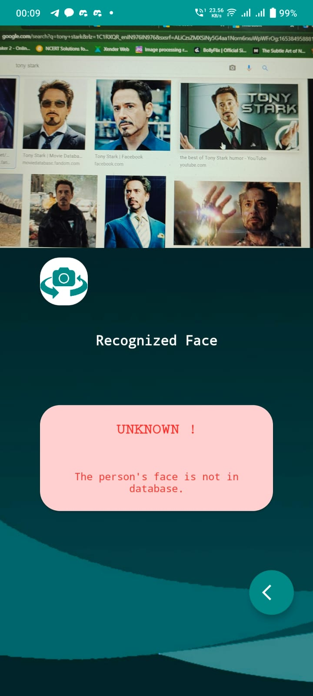
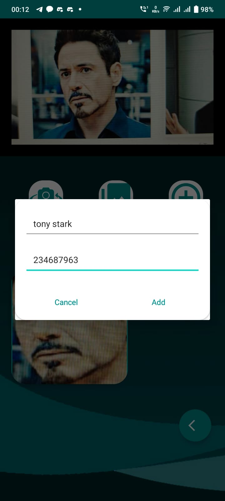
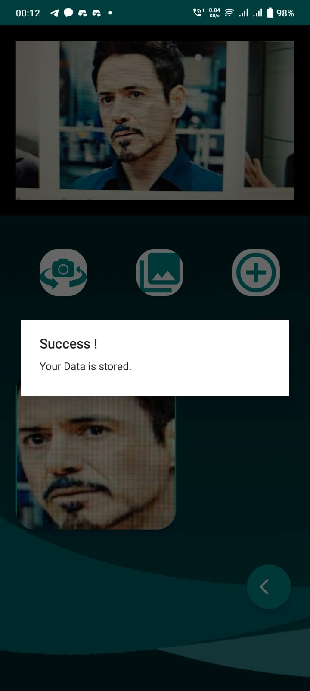
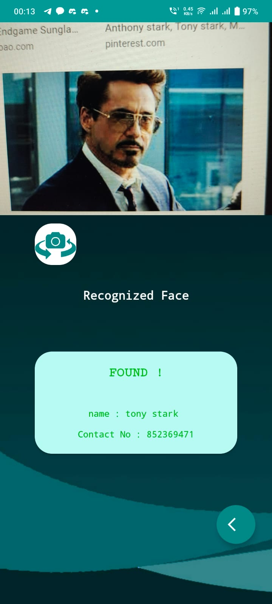
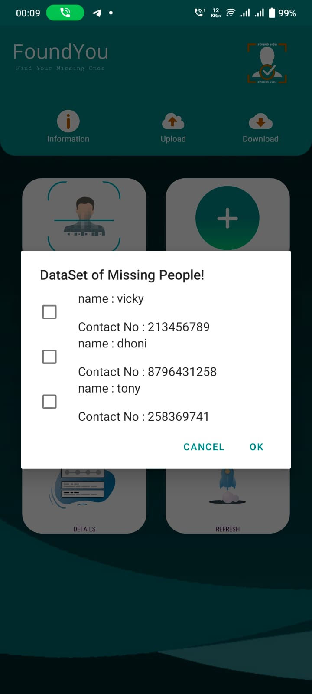
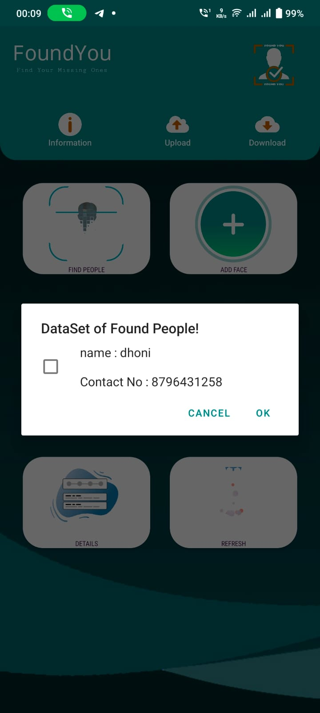
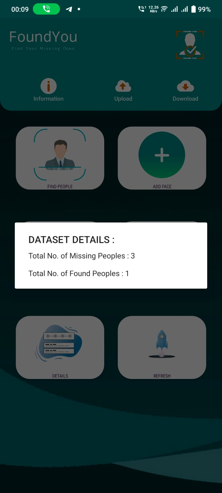

# FoundYou
Microsoft Engage mentee 2022 project
### Application file : [FoundYou.apk](https://drive.google.com/drive/folders/1n_LXN9lFrkodrha6FefRCesC5PyC8rOU?usp=sharing)
# Real Time Face Recognition App using TfLite

A minimalistic Face Recognition module which can be easily incorporated in any Android project.

## Key Features 
- No re-training required to add new Faces.
- Real-Time and offline.
- Fast and Accurate.
- Save Recognitions for further use.
- Simple UI.

## Tools and Frameworks used:
- Android Studio (Java)
- CameraX
- ML Kit
- TensorFlow Lite

## Model 
- MobileFaceNet : [Research Paper](https://arxiv.org/ftp/arxiv/papers/1804/1804.07573.pdf)
- [Implementation](https://github.com/sirius-ai/MobileFaceNet_TF)

## Installation

Use Import from Version Control in Android Studio or Clone repo and open the project in Android Studio.

```bash
git clone https://github.com/Dev-DeFire/FoundYou.git
```


## SCREENSHOTS !
<table>
  <tr>
    <td><b>1.SplashScreen</b></td>
     <td><b>2.Homepage</b></td>
     <td><b>3.Not Recognized</b></td>
     
  </tr>
  <tr>
    <td></td>
  <td></td>
    <td></td>
  
  </tr>
 </table>
 

 
 <table>
  <tr>
    <td><b>4.Take Data</b></td>
     <td><b>5.Stored Data</b></td>
     <td><b>6.Recognitized</b></td>
  </tr>
  <tr>
    <td></td>
    <td></td>
    <td></td>
  </tr>
 </table>
  
  
 <table>
  <tr>
    <td><b>7.Missing People Data</b></td>
     <td><b>8.Found People Data</b></td>
     <td><b>9.Details</b></td>
  </tr>
  <tr>
    <td></td>
    <td></td>
    <td></td>
  </tr>
 </table>


